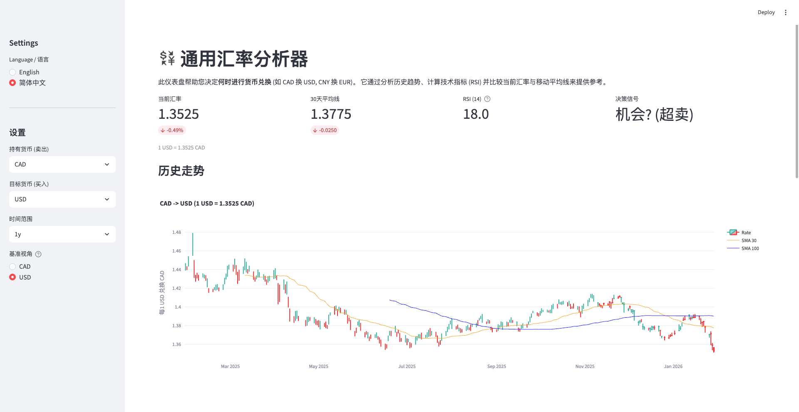
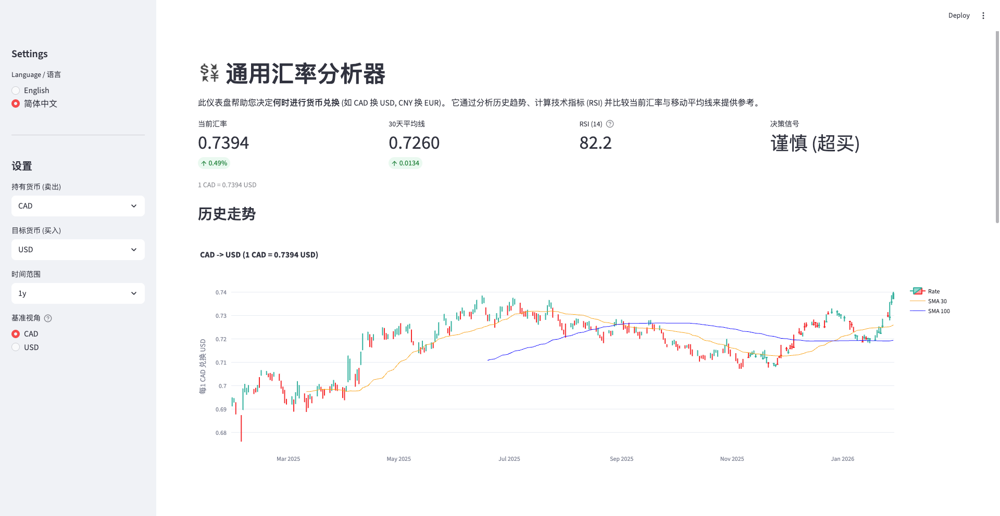

这份使用说明旨在帮助用户利用该**通用汇率分析器**，结合技术指标（RSI）与趋势线（SMA），做出理性的换汇决策。

---

## **通用汇率分析器使用指南**

本工具通过实时汇率、移动平均线（SMA）及相对强弱指数（RSI）三大核心维度，为您提供货币兑换的决策参考。

### **一、 视角切换与基准设定**

在左侧设置栏中，您可以选择不同的**基准视角**。这直接决定了图表的呈现逻辑：

* **以 USD 为基准（图 1）：** 观察“1 美元可以兑换多少加元”。图表上升代表美元升值，加元贬值。

* **以 CAD 为基准（图 2）：** 观察“1 加元可以兑换多少美元”。图表上升代表加元升值，美元贬值。

> **提示：** 根据您手里持有的货币来选择基准。例如，手里有加元想买美元，建议参考“CAD 视角”。

---

### **二、 核心技术指标解读**

#### **1. 实时汇率与 30/100 日均线 (SMA)**

图中包含三条关键曲线：

* **K 线（红绿柱状）：** 代表每日汇率的实际波动。
* **SMA 30（橙色线）：** 短期趋势线。代表过去 30 天的平均换汇成本。
* **SMA 100（蓝色线）：** 长期趋势线。代表过去 100 天的平均成本。

**分析逻辑：**

* **趋势判断：** 当橙色线上穿蓝色线时（如图 2 所示的“金叉”），预示该货币进入长期上升通道。
* **回归效应：** 汇率（K线）通常会向均线靠拢。如果 K 线远低于均线（如图 1 所示），说明短期跌幅过大，存在反弹动力。

#### **2. RSI (相对强弱指数)**

这是判断“买入/卖出信号”的核心：

* **超买 (RSI > 70)：** 代表该货币近期涨幅过大。此时汇率处于高位，**决策信号通常显示“谨慎”**，不建议此时追高买入。
* **超卖 (RSI < 30)：** 代表该货币近期跌幅过大。此时汇率处于低位，**决策信号通常显示“机会”**，是较好的买入点。

---

### **三、 实战案例分析**

#### **场景 A：手里有美元，想换加元（参考图 1）**

* **数据：** RSI 为 18.0（极低），当前汇率 1.3525 远低于 30 日均线（1.3775）。
* **结论：** 此时美元兑加元处于**极度超卖**。这意味着加元现在非常“贵”，美元非常“便宜”。
* **建议：** 如果不急用，建议等待美元反弹后再兑换加元。

#### **场景 B：手里有加元，想换美元（参考图 2）**

* **数据：** RSI 为 82.2（极高），处于**严重超买**状态。
* **结论：** 加元兑美元汇率正处于阶段性顶点，虽然换出的美元多，但随时可能面临回调。
* **建议：** 此时是卖出加元、买入美元的**极佳窗口期**。但由于 RSI 过高，不建议一次性全部兑换，可分批操作以防回调风险。

---

### **四、 操作建议总结**

1. **看结论：** 优先观察右侧“决策信号”。
2. **看 RSI：** 确认市场是否过热或过冷。
3. **看均线：** 判断当前汇率与平均成本的差距。